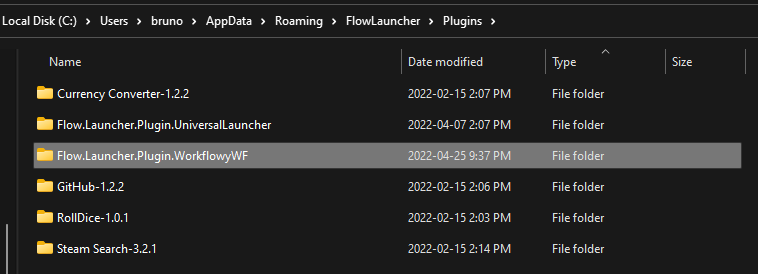

# Flow Launcher Plugin: wf

Quickly save notes on your Workflowy.


## Login

Required once and every ~6 months.

```
wf email password
```

## Save note

Saves on the root level.

```
wf your message here
```

## Installation

### 1. Install Node.js

This plugin is written in TypeScript, so you need to install Node.js to use it with Flow Launcher.

Please go to https://nodejs.org/ and download the LTS ("Long Term Support") version of Node.js.

### 2. Install the plugin

You can find this plugin in Flow's Plugin Store (in the app's settings), or by directly running this command in Flow Launcher:

```
pm install Workflowy
```

After installation the plugin will be in `%APPDATA%\FlowLauncher\Plugins\`.


